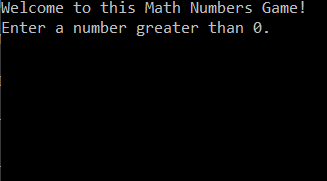

# Console Application README Example

## Number Game

Lab01-Exception-Handling

*Author: Chris Cummings*

----

## Description
This is a simple calculation game that takes in user input to create an array of the user specified length, and 
fills the array with user specified numbers.  It then sums and calculates a product based on the sum times a user
specified number from the array. Lastly, that product is divided by a user inputted value. All results are then displayed.

---

### Getting Started
Clone this repository to your local machine.

```
$ git clone https://github.com/cdcummings10/Lab01--NumbersGame
```

### To run the program from Visual Studio:
Select ```File``` -> ```Open``` -> ```Project/Solution```

Next navigate to the location you cloned the Repository.

Double click on the ```Lab01--NumbersGame``` directory.

Then select and open ```NumberGame.sln```

Click on ```Start```

### To run the executable:

Navigate to folder ```Lab01--NumbersGame``` directory.

Navigate through these folders: ```NumberGame``` => ```NumberGame``` => ```bin``` => ```Debug```

Run ```NumberGame.exe```
---

### Visuals

#### Application Start

#### Using the Application

#### Application End

#### Application Error


---

### Change Log 

1.1=0: *Finished Numbers Game. Added all functionality to app.* - 15 Oct 2019
